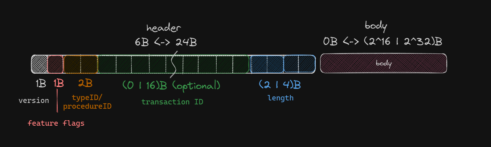

# __Bi__*(nary)*__S__*(erialization)*__P__*(rotocol)*


**BiSP** is a binary serialization protocol designed to be simple, fast, and efficient, ideal for scenarios where
JSON is too slow and Protobuf is too complex. Although language agnostic, the Go implementation uses reflection for
encoding and decoding data. Implementations in other languages must use their reflection libraries to match this
functionality. For interoperability, corresponding types and IDs must be synchronized between sender and receiver.

## How it works

The protocol uses a header to store information about the type and length of the payload, along with flags for extra
features like compression and transaction IDs. The payload is serialized using a 16-bit type ID. Types to be serialized
must be registered with the `bisp` package. Primitive types are registered automatically, but structs, arrays, maps, and
type aliases must be registered manually, ideally during the program's initialization phase and in the same order on
both server and client. While the library provides a method to sync type IDs from an external source, manually
implementing the reception of the type registry map from the server is required.

## Example

```go
package main

import (
	"fmt"
	"github.com/sindrebakk1/bisp"
	"net"
)

type TestStruct struct {
    Bool   bool
    Int    int
    Float  float64
    String string
}

func main() {
	msg := bisp.Message{
		Body: TestStruct{
			Bool:   true,
			Int:    42,
			Float:  3.14,
			String: "Hello, World!",
		},
	}

	client, server := net.Pipe() 
	// Send a message
	go func() {
		encoder := bisp.NewEncoder(server)
		err := encoder.Encode(msg)
		if err != nil {
			panic(err)
		}
	}()
	
	// Receive a message
	decoder := bisp.NewDecoder(client)
	var response bisp.Message
	err := decoder.Decode(&response)
	if err != nil {
		panic(err)
	}

	fmt.Printf("%+v\n", response.Body.(TestStruct))
}

func init() {
	// Register the struct with the bisp package
	// This is necessary for the encoder and decoder to be able to encode and decode the struct
	// Types that have to be registered are; Structs, Arrays, and Maps as well as any type aliases such as enums
	bisp.RegisterType(TestStruct{})
}
```

## Protocol

> ### Header (6 <> 24 bytes)
> - **version:** _1B_ - the version of the protocol
> - **flags:** _1B_ - flags that can be set to enable extra features
> - **type:** _2B_ - the type ID of the payload
> - **transaction ID:** _(16 | 0)B_ - only present if the FTransaction flag is set
> - **payload length:** _(2 | 4)B_ - the length of the payload, 4 bytes if the F32b flag is set
> ### Payload (0 <> 2^16 | 2^32 bytes)
> - **payload:** _0 - (2^16 | 2^32)B_ - the serialized payload

## Flags
> - **FError:** Error - If this flag is set, the payload is an error message
> - **FTransaction:** Transaction - If this flag is set, the transaction id is present in the header
> - **F32b:** 32 bit lengths - If this flag is set, all lengths are 32 bits instead of 16 bits
> - **FHuff:** Huffman - If this flag is set, the payload will be compressed using the huffman algorithm
> - **FRle:** Run Length Encoding - If this flag is set, the payload will be compressed using the Run Length Encoding algorithm
> - **FEnc:** Encryption - If this flag is set, the payload will be encrypted
> - **FProc:** Procedure call - If this flag is set, the payload is a procedure call

## Primitive Types
TODO

## Procedure Calls
TODO

## TODO
- [ ] Features:
  - [X] Transaction ID
  - [X] 32 bit lengths
  - [ ] Procedure calls
    - [X] Encode
    - [ ] Decode
  - [ ] Error handling - only relevant for procedures?
  - [ ] Compression
  - [ ] Encryption
  - [ ] Type syncing
- [ ] Tests:
  - [x] Arrays
  - [ ] Error handling
  - [ ] Type aliases
  - [ ] Two-dimensional slices and arrays
- [ ] Benchmarks
  - [X] Encoding
  - [X] Decoding
  - [X] Receive and Respond
  - [X] Large messages
    - [X] 16b length
    - [X] 32b length
  - [ ] Compression
- [ ] Optimizations
  - [ ] Use a pool for the encoder and decoder?
  - [ ] Use a pool for the huffman encoder and decoder?
  - [ ] Use unsafe pointers to avoid reflection where reasonable
  - [X] Large string, slice and array optimizations
  - [ ] Large struct optimizations
  - [ ] Large map optimizations
- [ ] Documentation
  - [ ] Examples
    - [X] Simple
    - [ ] Complex
    - [ ] Error handling
    - [ ] Compression
    - [ ] Transaction ID
    - [ ] Encryption
    - [ ] Procedure calls
  - [X] Protocol
  - [X] Flags
  - [ ] Procedure calls
  - [ ] Primitive types
  - [ ] Type registration
  - [ ] Type syncing
